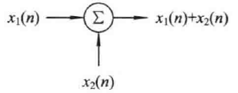

# 3.1 系统描述和分类

## 一、按系统处理的信号分类

### 1.连续时间系统

### 2.离散时间系统

### 3.混合系统

## 二、按系统是否有记忆功能分类

### 1.无记忆系统

### 2.记忆系统

包含电容、电感等记忆元件

## 三、按元件参数是否集总分类

### 1.集总参数系统

电路尺寸远小于波长

### 2.分布参数系统

电路尺寸与波长相近

## 四、按系统是否存在逆系统分类

### 1.可逆系统

### 2.不可逆系统

## 五、按系统输出是否有界分类

### 1.稳定系统

### 2.不稳定系统

## 六、按输出信号与输入信号的先后关系分类

### 1.因果系统

输出只和当时及以前的输入有关

### 2.非因果系统

输出和之后的输入有关

# 3.2 线性时不变(LTI)系统

## 3.2.1 线性

### 齐次性

$\large af_1 \rightarrow ay_1$

### 可加性

$\large f_1+f_2 \rightarrow y_1+y_2$

### 线性

$\large af_1+bf_2 \rightarrow ay_1+by_2$

## 3.2.2 时不变

若系统符合时不变性，则在输入延时的情况下输出也相应延时

若f(·)前出现变系数，或有反转、展缩变换，则该系统为时变系统

## 3.2.3 连续LTI系统的微积分特性

### 1.微分特性

$\large x(t) \rightarrow y(t),{d \over dt}x(t) \rightarrow {d \over dt}y(t)$

### 2.积分特性

$\large x(t) \rightarrow y(t), \int_{-\infty}^tx(a)da \rightarrow \int_{-\infty}^ty(a)da$

# 3.3 微分方程和差分方程的建立

输入为u(t)，输出为i(t)

$\large i(t)R_1+u_C(t)=u(t)$

$\large i_L(t)R_2+L{di_L(t) \over dt}=u_C(t)$

$\large i(t)-i_L(t)=C{du_C(t) \over dt}$

输入输出方程

$\large R_1CL{d^2i(t) \over dt^2}+(R_1R_2C+L){di(t) \over dt}+(R_1+R_2)i(t)=CL{d^2u(t) \over dt^2}+R_2C{du(t) \over dt}+u(t)$

# 3.4 传输算子

## 3.4.1连续算子及联系系统传输算子

### 1.微分算子

$\Large p = {d \over dt}$

### 2.积分算子

$\Large {1\over p}=\int_{-\infty}^{t}(\cdot)d\tau$

### 3.运算规则

算子多项式可以进行因式分解或因式相乘

微分与积分次序不得交换

### 4.传输算子

$\Large A(p)y(t)=B(p)x(t)$

$\Large H(p)={y(t) \over x(t)}={B(p) \over A(p)}$

### 5.电容电感

电容：$\large R={1 \over Cp}$

电感：$\large R=Lp$

## 3.4.2 离散算子及离散系统传输算子

### 1.滞后算子

$\Large E^{-1}x(n)=x(n-1)$

### 2.超前算子

$\Large Ex(n)=x(n+1)$

### 3.传输算子

$\Large A(E)y(n)=B(E)x(n)$

$\Large H(E)={y(n) \over x(n)}={B(E) \over A(E)}$

# 3.5 系统方框图和信号流图

## 3.5.1 系统方框图

### 一、连续系统

#### 1.加法器

#### 2.积分器

积分器的抗干扰性比微分器好

#### 3.数乘器

### 二、离散系统

#### 1.加法器

#### 2.延迟器

#### 3.数乘器

## 3.5.2 信号流图

### 一、名词解释

1. 节点：变量、信号
2. 支路：有向线段
3. 通路：沿箭头方向通过个相连支路的途径
4. 开通路：通路与任一结点相遇不多于一次
5. 闭环：通路的终点就是起点
6. 前向通路：从输入到输出，通过任一节点不多于一次

### 二、基本性质

信号只能沿箭头方向传输

节点有多个输入时将所有信号相加，并传给与该节点相连的输出支路

### 三、梅森公式

$\Large H(\cdot)={1 \over \Delta}\sum_kG_k \cdot \Delta_k$

环路：

1-2-1 : $\Large L_1=-{3 \over p}$

2-3-2 : $\Large L_2=-{6 \over p}$

3-4-3 : $\Large L_3=-{5 \over p}$

1-2-3-1 : $\Large L_4={2 \over p^2}$

1-4-3-2-1 : $\Large L_5=-270$

1-4-3-1 : $\Large L_6=-30$

不接触的环路：

$\Large L_1L_3={15 \over p^2}$

特征行列式：

$\Large \Delta=1-(L_1+L_2+L_3+L_4+L_5+L_6)+L_1L_3=301+{14 \over p}+{13 \over p^2}$

前向通路：

x-1-2-3-4-y : $\large G_1={2 \over p^3}$ 去掉该通路后无环路 $\large \Delta_1=1$

x-1-4-y : $\large G_2=6$ 去掉该通路后剩L2 $\large \Delta_2=1-L_2=1+{6 \over p}$

传输算子：

$\Large H(p)={G_1\Delta_1+G_2\Delta_2 \over \Delta}={6p^3+36p^2+2 \over 301p^3+14p^2+13p}$

算子方程：

$(6p^3+36p^2+2)x(t)=(301p^3+14p^2+13p)y(t)$

# 3.6 系统实现

## 3.6.1 直接实现

$\Large y(n)+ay(n-1)+by(n-2)=cx(n)+ex(n-1)$

$\Large H(E)={y(n) \over x(n)}={c+eE^{-1} \over 1-(-aE^{-1}-bE^{-2})}$

## 3.6.2 级联实现

$\Large H(p)={2 \over (p+1)(p+2)(p+3)}={2 \over p+1} \cdot {1 \over p+2} \cdot {1 \over p+3}$

$\Large H_1(p)={2 \over p+1} = {2p^{-1} \over 1+p^{-1}}$

$\Large H_2(p)={1 \over p+2} = {p^{-1} \over 1+2p^{-1}}$

$\Large H_3(p)={1 \over p+3} = {p^{-1} \over 1+3p^{-1}}$

## 3.6.3 并联实现

$\Large H(E)={y(n) \over x(n)}={1 \over 1+3E^{-1}+2E^{-2}}=-{1 \over 1+E^{-1}}+{2 \over 1+2E^{-1}}$

$\Large H_1(E)=-{1 \over 1+E^{-1}}$

$\Large H_2(E)=-{2 \over 1+2E^{-1}}$

