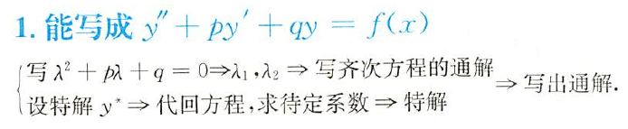
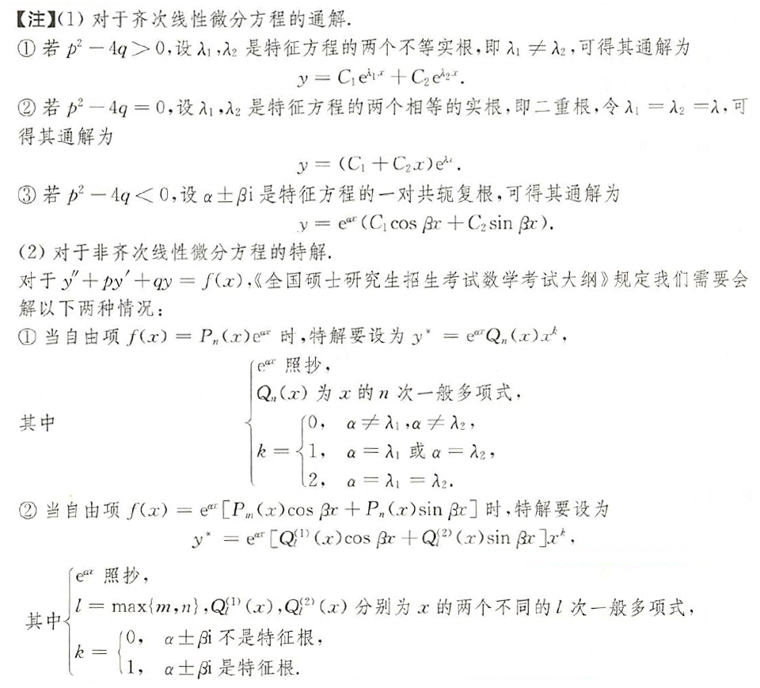
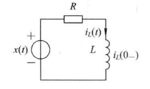
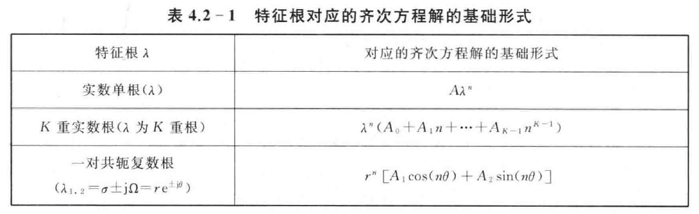
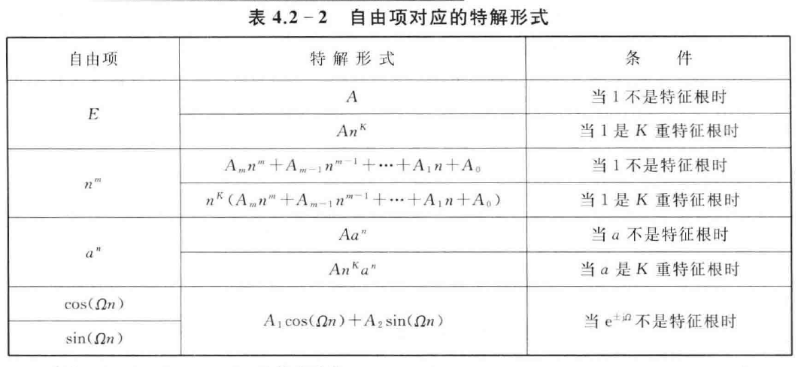
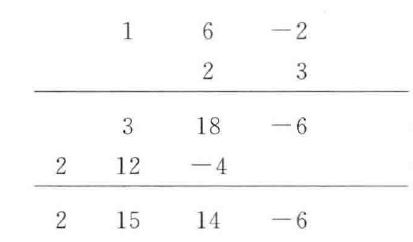

# 4.1 连续时间系统的时域分析

## 4.1.1 微分方程的求解

齐次解：自由响应

特解：强迫响应

## 4.1.2 起始状态到初始状态的转换

### 一、定义

起始状态：$\large y(0_-)$

初始状态：$\large y(0_+)$

### 二、冲激平衡法

$\large {d \over dt}y(t) + 2y(t)={d \over dt}x(t)$

已知：$\large x(t)=5\delta(t)$，$\large y(0_-)=-2$  求：$\large y(0_+)$

代入得：$\large {d \over dt}y(t) + 2y(t)=5\delta'(t)$

根据**冲激平衡法**，$\large {d \over dt}y(t)$中包含$\large 5\delta'(t)$

t=0时，$\large {d \over dt}y(t)=5\delta'(t)+A\delta(t)$，$\large y(t)=5\delta(t)$

代入得：$\large 5\delta'(t)+A\delta(t)+10\delta(t)=5\delta'(t)$

$\large A=-10$

即$\large {d \over dt}y(t)$中包含$\large -10\delta'(t)$

$\large y(0_+)-y(0_-)=-10$

$\large y(0_+)=y(0_-)-10=-2-10=-12$

## 4.1.3 连续时间系统的零输入响应与零状态响应

### 一、定义

零输入响应：$\large y_{zi}(t)$ ，外加激励为0，仅由系统的起始状态所引起的响应

零状态响应：$\large y_{zs}(t)$ ，起始状态为0，仅由激励所引起的响应

完全响应：$\large y(t)=y_{zi}(t) + y_{zs}(t)$

### 二、双零法

$\large R=1,L={1 \over 4}H,i_L(0_-)=2,x(t)=e^{-3t}u(t)$

#### 1.零输入响应

$\large {di_{Lzi}(t) \over dt} + 4i_{Lzi}(t)=0$

右边无冲激，则$\large {di_{Lzi}(t) \over dt}$无冲激，$i_{Lzi}(t)$无突变

$\large i_{Lzi}(0_-)=i_{Lzi}(0_+)=i_L(0_-)=2$

解方程得$\large i_{Lzi}(t)=Ce^{-4t}u(t)$

$\large i_{Lzi}(0_+)=Cu(0_+)=C=2$

零输入响应$\large i_{Lzi}(t)=2e^{-4t}u(t)$

#### 2.零状态响应

$\large {di_{Lzs}(t) \over dt} + 4i_{Lzs}(t)=4e^{-3t}u(t)$

右边无冲激，则$\large {di_{Lzs}(t) \over dt}$无冲激，$i_{Lzs}(t)$无突变

$\large i_{Lzs}(0_-)=i_{Lzs}(0_+)=0$

解方程得$\large i_{Lzs}(t)=(4e^{-3t}+Be^{-4t})u(t)$

$\large i_{Lzs}(0_+)=4+B=0$

$\large i_{Lzs}(t)=(4e^{-3t}-4e^{-4t})u(t)$

#### 3.完全响应

$\large i_L(t)=i_{Lzi}(t)+i_{Lzs}(t)=(4e^{-3t}-2e^{-4t})u(t)$

## 4.1.4 冲激响应

### 一、定义

单位冲激信号作用下系统的零状态响应，用$h(t)$表示

### 二、求解

已知：$\Large {d^2y(t) \over dt^2}+6{dy(t) \over dt}+5y(t)=3{dx(t) \over dt}+2x(t)$

求：$\Large h(t)$

假设右边仅有$\large \delta(t)$

$\Large {d^2y(t) \over dt^2}+6{dy(t) \over dt}+5y(t)=\delta(t)$

右面有冲激，则二阶导存在冲激，其余不存在

则$\large h'_0(0_+)-h'_0(0_-)=1$ $\Large h_0(0_+)=h_0(0_-)$

当$\large t>0$时，$\large {d^2y(t) \over dt^2}+6{dy(t) \over dt}+5y(t)=0$

解方程得$\large h_0(t)=(C_1e^{-t}+C_2e^{-5t})u(t)$

代入初始条件得$\large h_0(t)=({1 \over 4}e^{-t}+{1 \over 4}e^{-5t})u(t)$

根据线性时不变特性：

输入为$\large 2\delta(t)$时，$\large 2h_0(t)=2({1 \over 4}e^{-t}+{1 \over 4}e^{-5t})u(t)$

输入为$\large 3\delta'(t)$时，$\large 3h_0'(t)=3(-{1 \over 4}e^{-t}+{5 \over 4}e^{-5t})u(t)$

冲激响应为$\large h(t)=3h_0'(t)+2h_0(t)=(-{1 \over 4}e^{-t}+{13 \over 4}e^{-5t})u(t)$

## 4.1.5 阶跃响应

### 一、定义

单位阶跃信号作用下系统的零状态响应，用$\large g(t)$表示

### 二、求解

#### 1.法一

假设右边仅有$\large u(t)$，求得$\large g_0(t)$，根据线性时不变特性求得$\large g(t)$

#### 2.法二

$\Large g(t)=\displaystyle\int_{-\infty}^{t}h(\tau)d\tau$

$\Large h(t) = {dg(t) \over dt}$

# 4.2 离散时间系统的时域分析

## 4.2.1 差分方程的求解

### 一、迭代法

不能得到解析形式的闭合解

### 二、经典法

## 4.2.2 离散时间系统的零输入响应与零状态响应

### 一、定义

零输入响应：$\large y_{zi}(n)$ ，外加激励为0，仅由系统的起始状态所引起的响应。$\large n<0$时$\large y(n)=y_{zi}(n)$

零状态响应：$\large y_{zs}(n)$ ，起始状态为0，仅由激励所引起的响应

完全响应：$\large y(n)=y_{zi}(n) + y_{zs}(n)$

### 二、双零法

已知：$\large y(n)+y(n-1)-2y(n-2)=u(n)$ ， $\large y(0)=1,y(1)=4$

求解：零输入响应、零状态响应、完全响应

#### 1.零输入响应

给出的初始条件受输入激励影响，用迭代法计算$y(-1)$与$y(-2)$

$\large y_{zi}(-1)=2,y_{zi}(-2)=1$

$\large y_{zi}(n)+y_{zi}(n-1)-2y_{zi}(n-2)=0$

特征方程为$\large \lambda^2+2\lambda -2=0$

$\large y_{zi}(n)=[A_1+A_2(-2)^n]u(n)$

代入初始条件计算得$\large A_1={4 \over 3},A_2=-{4 \over 3}$

$\large y_{zi}(n)=[{4 \over 3}-{4 \over 3}(-2)^n]u(n)$

#### 2.零状态响应

$\large y_{zs}(n)+y_{zs}(n-1)-2y_{zs}(n-2)=u(n)$

$\large y_{zs}(-1)=y_{zs}(-2)=0$

齐次解：

$\large y_{zs}(n)=B_1+B_2(-2)^n$

$n \ge 0$时，特解为：

$\large y_{zsp}(n)=Cn$

代入原式得$\large C={1 \over 3}$

$\large y_{zs}(n)=[B_1+B_2(-2)^n+{1 \over 3}n]u(n)$

代入$n=0,1$计算得$\large B_1={5 \over 9},B_2={4 \over 9}$

$\large y_{zs}(n)=[{5 \over 9}+{4 \over 9}(-2)^n+{1 \over 3}n]u(n)$

#### 3.完全响应

$\large y(n)=y_{zi}(n) + y_{zs}(n)=[{17 \over 9}-{8 \over 9}(-2)^n+{1 \over 3}n]u(n)$

## 4.2.3 脉冲响应

### 一、定义

单位脉冲信号作用下系统的零状态响应，用$h(n)$表示

### 二、求解

已知：$\large y(n)+5y(n-1)+6y(n-2)=2x(n)+3x(n-1)$

求解：单位样值响应

$\large h_0(n)+5h_0(n-1)+6h_0(n-2)=\delta(n)$

方程仅含齐次解，根据特征方程解得：

$\large h_0(n)=[A_1(-2)^n+A_2(-3)^n]u(n)$

易知$\large h_0(-1)=h_0(-2)=0$

根据迭代法知$\large h_0(0)=1,h_0(1)=-5$

代入得$\large h_0(n)=[-2(-2)^n+3(-3)^n]u(n)$

根据线性时不变特性：

$\large h(n)=2h_0(n)+3h_0(n-1)=2\delta(n)+[-(-2)^n+3(-3)^n]u(n-1)$

## 4.2.4 阶跃响应

### 一、定义

单位阶跃信号作用下系统的零状态响应，用$\large g(n)$表示

### 二、求解

#### 1.法一

假设右边仅有$\large u(n)$，求得$\large g_0(t)$，根据线性时不变特性求得$\large g(t)$

#### 2.法二

$\Large g(k)=\displaystyle\sum_{i=-\infty}^{k}h(i)$

$\Large h(n) = g(n)-g(n-1)$

# 4.3 卷积积分与卷积和

## 4.3.1 卷积积分及其应用

### 一、时域分解

使用门函数拟合任意函数：$\large \hat{f(t)} = \displaystyle\sum_{n=-\infty}^{\infty}f(n\Delta)\cdot \Delta \cdot g_\tau(t-n\Delta)$

$\large f(t)=\lim\limits_{\Delta \to 0}\hat{f(t)}=\displaystyle\int_{-\infty}^{\infty}f(\tau)\delta(t-\tau)d\tau$

### 二、卷积定义

$\Large f(t)=\displaystyle\int_{-\infty}^{\infty}f_1(\tau)f_2(t-\tau)d\tau=f_1(t)*f_2(t)$

系统的零状态响应$\large y_{zs}(t)=\large x(t)*h(t)$

### 三、卷积性质

#### 1.结合律

#### 2.交换律

#### 3.分配率

#### 4.卷积特性

$\large f(t)*\delta(t)=f(t)$

$\large f(t)*\delta(t-t_0)=f(t-t_0)$

$\large f(t)*\delta'(t)=f'(t)$

$\large f(t)*u(t)=\displaystyle\int_{-\infty}^tf(\tau)d\tau$

#### 5.时移性

$\large f_1(t-t_1)*f_2(t-t_2)=f_1(t-t_1-t_2)*f_2(t)=f_2(t-t_1-t_2)*f_1(t)$

#### 6.微积分性质

$\large [f_1(t)*f_2(t)]'=f_1'(t)*f_2(t)=f_1(t)*f_2'(t)$

$\large \int[f_1(t)*f_2(t)]dt=\int f_1(t)dt*f_2(t)=f_1(t)*\int f_2(t)dt$

$\large f_1(t)*f_2(t)=\int f_1(t)dt*f_2'(t)=f_1'(t)*\int f_2(t)dt$

### 四、卷积计算

#### 1.定义法

#### 2.图解法

变量替换 -> 反褶 -> 时移 -> 相乘 -> 积分

#### 3.性质法

## 4.3.2 卷积和及其应用

### 一、卷积定义

$\Large f(t)=\displaystyle\sum_{m=-\infty}^{\infty}f_1(m)f_2(n-m)=f_1(n)*f_2(n)$

系统的零状态响应$\large y_{zs}(n)=\large x(n)*h(n)$

### 二、卷积性质

#### 1.结合律

#### 2.交换律

#### 3.分配率

#### 4.卷积特性

$\large f(n)*\delta(n)=f(n)$

$\large f(n)*\delta(n-N)=f(n-N)$

#### 5.位移性

$\large f_1(n-N_1)*f_2(n-N_2)=f_1(n-N_1-N_2)*f_2(n)=f_2(n-N_1-N_2)*f_1(n)$

### 三、卷积计算

#### 1.定义法

#### 2.图解法

变量替换 -> 反褶 -> 位移 -> 相乘 -> 求和

#### 3.性质法

#### 4.竖式法

已知：$\large f_1(n)=\{1,6,2\}_{(0)}$  $\large f_2(n)=\{2,3\}_{(-1)}$

求解：$\large f(n)=f_1(n)*f_2(n)$

由于位移性$\large \{...\}_{N1} * \{...\}_{N2}=\{...\}_{N1+N2}$

$\large f(n)=f_1(n)*f_2(n)=\{2,15,14,-6\}_{(-1)}=2\delta(n+1)+15\delta(n)+14\delta(n-1)-6\delta(n-2)$

