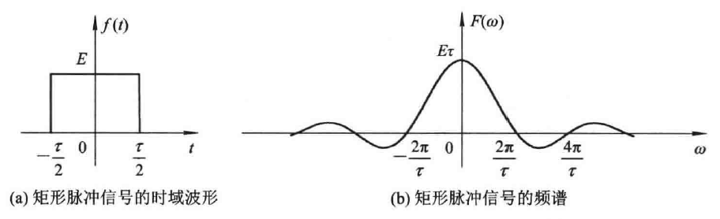
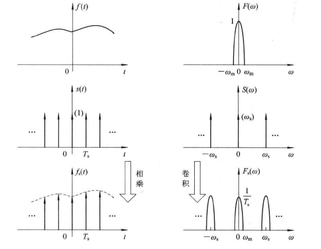
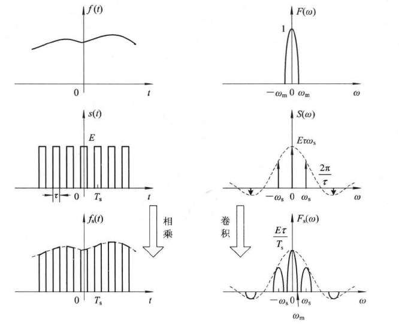

# 5.1 信号的正交函数分解

正弦信号叠加得到周期信号

叠加的正弦信号越多，越接近理想波形

构成周期信号的所有正弦信号的频率是叠加信号频率的整数倍

改变正弦信号的振幅可以得到不同的叠加图形

正弦信号作用到先形式不变系统时的输出仍是正弦信号，室友幅度和相位可能变化，其频率和波的形状不变

# 5.2 周期信号的傅里叶级数

## 5.2.1 傅里叶级数的三角形式

### 一、狄里赫利条件

在一个周期内，如果有间断点存在，则间断点的数目有限

在一个周期内，极大值和极小值的数目有限

在一个周期内,信号是绝对可积的

### 二、傅里叶级数

$\large f(t)=a_0+\sum_{n=1}^\infty[a_ncos(n\omega_1t)+b_nsin(n\omega_1t)]$

$\large a_0={1 \over T_1}\int_{T_1}f(t)dt$

$\large a_n={2 \over T_1}\int_{T_1}f(t)cos(n\omega_1t)dt$

$\large b_n={2 \over T_1}\int_{T_1}f(t)sin(n\omega_1t)dt$

### 三、周期特性

原函数为奇函数，$\large a_n=0$

原函数为偶函数，$\large b_n=0$

### 四、谐波特性

#### 1.奇谐函数

$\large f(t)=-f(t \pm {T \over 2})$

傅里叶级数中只含有奇次谐波

$\large a_0=a_2=...=b_2=b_4=...=0$

#### 2.偶谐函数

$\large f(t)=f(t \pm {T \over 2})$

傅里叶级数中只含有偶次谐波

$\large a_1=a_3=...=b_1=b_3=...=0$

## 5.2.2 傅里叶级数的指数形式

由欧拉公式得：

$\Large cos(n\omega_1t)={1\over 2}(e^{jn\omega_1t}+e^{-jn\omega_1t})$

$\Large sin(n\omega_1t)={1\over 2j}(e^{jn\omega_1t}-e^{-jn\omega_1t})$

$\displaystyle\Large f(t)=a_0+\sum_{n=1}^\infty[{a_n\over 2}(e^{jn\omega_1t}+e^{-jn\omega_1t})+{b_n\over 2j}(e^{jn\omega_1t}-e^{-jn\omega_1t})]\\\Large=a_0+\sum_{n=1}^\infty({a_n-jb_n\over 2}e^{jn\omega_1t})+\sum_{n=1}^\infty({a_n+jb_n\over 2}e^{-jn\omega_1t})$

令：$\Large F_n={a_n-jb_n \over 2}$  $\Large F_{-n}={a_{-n}-jb_{-n} \over 2}={a_n+jb_n \over 2}$

$\displaystyle\Large f(t)=\sum_{n=-\infty}^{\infty}F_ne^{jn\omega_1t}$

$\Large F_n={1 \over T_1}\int_{T_1}f(t)e^{-jn\omega_1t}dt$

## 5.2.3 周期信号的频谱

原函数：$\large f(t)=1+3cos(2t)+4sin(2t)+cos(4t+0.25\pi)$

三角形式：$\large f(t)=1+5cos(2t-0.295\pi)+cos(4t+0.25\pi)$

单边谱：

| 频率 | 幅度 |    相位     |  备注   |
| :--: | :--: | :---------: | :-----: |
|  0   |  1   |      0      | 直流量  |
|  2   |  5   | $-0.295\pi$ |  基波   |
|  4   |  1   |  $0.25\pi$  | 2次谐波 |

指数形式：$\large f(t)=1+{5\over 2}e^{j2t}e^{-j0.295\pi}+{5\over 2}e^{-j2t}e^{j0.295\pi}+{1\over 2}e^{j4t}e^{j0.25\pi}+{1\over 2}e^{-j4t}e^{-j0.25\pi}$

双边谱：

| 频率 | 幅度 |    相位     |
| :--: | :--: | :---------: |
|  -4  | 1/2  | $-0.25\pi$  |
|  -2  | 5/2  | $0.295\pi$  |
|  0   |  1   |      0      |
|  2   | 5/2  | $-0.295\pi$ |
|  4   | 1/2  |  $0.25\pi$  |

## 5.2.4 帕斯瓦尔定理

信号的总能量既可以按照每单位时间内的能量在整个时间内的积分计算出来，也可以按照每单位频率内的能量在整个频率范围内的积分而得到

$\large f(t)=c_0+\sum_{n=1}^{\infty}c_ncos(n\omega_1t+\varphi_n)$

$\large P={1 \over T_1}\int_{T_1}|f(t)|^2dt={1 \over T_1}\int_{T_1}[c_0+\sum_{n=1}^{\infty}c_ncos(n\omega_1t+\varphi_n)]^2dt\\\large=c_0^2+{1 \over 2}\sum_{n=1}^{\infty}c_n^2=\sum_{n=1}^{\infty}|F_n|^2$

直流到**4次谐波**的能量占总能量的89.886%

对于一般周期信号，通常把集中周期信号平均功率**90%**以上的谐波频率范围定义为信号的频带宽度，简称**信号带宽**

# 5.3 傅里叶变换

## 5.3.1 傅里叶变换

对于非周期信号，看做$T \rightarrow \infty$的周期信号

$\large F_n={1 \over T_1}\int_{T_1}f(t)e^{-j\omega_1t}dt \rightarrow 0$

$\large \omega={2\pi \over T} \rightarrow 0$

离散频谱趋向连续，频谱幅度趋向0，不适合使用傅里叶级数表示

引入频谱密度

$\large F(\omega)=\lim\limits_{T\rightarrow \infty}{F_n \over {1 \over T}}=\lim\limits_{T\rightarrow \infty}\int_{-{T \over 2}}^{T \over 2}f(t)e^{-j\omega t}dt=\int_{-\infty}^{\infty}f(t)e^{-j\omega t}dt$

傅里叶正变换：

$\large \mathcal F[f(t)]=F(\omega)=\int_{-\infty}^{\infty}f(t)e^{-j\omega t}dt$

傅里叶反变换：

$\large \mathcal F^{-1}[F(\omega)]=f(t)={1 \over 2\pi}\int_{-\infty}^{\infty}F(\omega)e^{j\omega t}dt$

## 5.3.2 典型非周期信号的傅里叶变换

### 一、冲激信号

$\large \mathcal F[\delta(t)]=\int_{-\infty}^{\infty}\delta(t)e^{-j\omega t}dt=1$

### 二、矩形脉冲信号

$\large F(\omega)=\int_{-{\tau \over 2}}^{\tau \over 2}Ee^{-j\omega t}dt=\tau ESa({\omega\tau \over 2})$

### 三、单边指数信号

$\large f(t)=Ee^{-at}u(t)$

$\large F(\omega)=\int_0^{\infty}Ee^{-at}e^{-j\omega t}dt={E \over a+j\omega}$

$\large |F(\omega)|={E \over \sqrt{a^2+\omega^2}}$  $\large \varphi(\omega)=-arctan({\omega \over a})$

### 四、双边指数信号

$\large f(t)=Ee^{-a|t|}$

$\large F(\omega)={2a \over \omega^2+a^2}$

### 五、直流信号

直流信号不符合绝对可积

时域变化最快的信号在频域是常数，时域变化最慢的信号在频域为冲激

$\large \mathcal F^{-1}[\delta(\omega)]={1 \over 2\pi}\int_{-\infty}^{\infty}\delta(\omega)e^{j\omega t}dt={1 \over 2\pi}$

$\large 1 \leftrightarrow 2\pi\delta(\omega)$

## 5.3.3 傅里叶变换的性质

线性：$\large a_1f_1(t)+a_2f_2(t) \leftrightarrow a_1F_1(\omega)+a_2F_2(\omega)$

奇偶性：$\large f(t) \leftrightarrow F(\omega),f(-t) \leftrightarrow F(-\omega)$

对称性：$\large f(t) \leftrightarrow F(\omega),F(t) \leftrightarrow 2\pi f(-\omega)$

尺度变换：$\large f(t) \leftrightarrow F(\omega),f(at) \leftrightarrow |{1 \over a}|F({\omega \over a})$

时移：$\large f(t) \leftrightarrow F(\omega),f(t \pm t_0) \leftrightarrow e^{\pm jwt_0}F(\omega)$

频移：$\large f(t) \leftrightarrow F(\omega),e^{\mp j\omega_0t}f(t) \leftrightarrow F(\omega \pm \omega_0)$

卷积：$\large f_1(t) \leftrightarrow F_1(\omega),f_2(t) \leftrightarrow F_2(\omega)$

​			$\large f_1(t)*f_2(t)=F_1(\omega)F_2(\omega),f_1(t)f_2(t)={1 \over 2\pi}F_1(\omega)*F_2(\omega)$

积分：$\large \int_{-\infty}^{t}f(\tau)d\tau \leftrightarrow {1 \over j\omega}F(\omega)+\pi F(0)\delta(\omega)$

​			$\large \int_{-\infty}^{\omega}F(\tau)d\tau \leftrightarrow {j \over t}f(t)+\pi f(0)\delta(t)$

微分：$\large {df(t) \over dt} \leftrightarrow j\omega F(\omega)$

​			$\large {dF(\omega) \over d\omega} \leftrightarrow -jtf(t)$

帕斯瓦尔定理：$\large \int_{-\infty}^{\infty}|f(t)|^2dt={1\over 2\pi}\int_{-\infty}^{\infty}|F(\omega)|^2d\omega$

## 5.3.4 周期信号的傅里叶变换

### 一、傅里叶变换

$\large f(t)e^{j\omega_0t} \leftrightarrow F(\omega-\omega_0)$

$\large f(t)=1, e^{j\omega_0t} \leftrightarrow 2\pi\delta(\omega-\omega_0)$

$\large cos(\omega_0t)={1 \over 2}[e^{j\omega_0t}+e^{-j\omega_0t}] \leftrightarrow  \pi[\delta(\omega-\omega_0)+\delta(\omega+\omega_0)]$

对于周期函数：$\displaystyle\large f(t)=\sum_{m=-\infty}^{\infty}F_ne^{jn\omega_1t}$

$\displaystyle\large \mathcal F[f(t)]=\sum_{m=-\infty}^{\infty}F_n\mathcal F(e^{jn\omega_1t})=2\pi\sum_{m=-\infty}^{\infty}F_n\delta(\omega-n\omega_1)$

### 二、傅里叶变换与傅里叶级数

周期信号傅里叶级数展开的系数和从周期信号中截取一个周期的傅里叶变换满足：

$\large F_n={1 \over T_1}F(\omega)|_{\omega=n\omega_0}$

# 5.4 抽样和抽样定理

## 5.4.1 抽样和抽样信号频谱

### 一、采样原理

$\large f_s(t)=f(t) \times s(t)$

$\large F_s(\omega)={1 \over 2\pi}F(\omega)*S(\omega)$

### 二、理想采样

使用冲激函数$\displaystyle\large s(t)=\sum_{n=-\infty}^{\infty}\delta(t-nT_s)$进行采样

$\displaystyle\large F_s(\omega)={1 \over T_s}\sum_{n=-\infty}^{\infty}F(\omega-n\omega_s)$

理想抽样信号的频谱是原连续信号的频谱乘以$\large {1 \over T_s}$并位移相加构成的

### 三、实际采样

使用脉冲函数进行采样

实际抽样信号的频谱仍是原频谱的平移，只是波形大小发生变化，横向没有展缩

## 5.4.2 时域抽样定理

抽样信号的频谱是原连续信号频谱的平移，距离为$\large \omega_s$，由采样频率决定

想从抽样信号的频谱中恢复连续时间信号，只需恢复原信号的频谱即可，故要保证抽样信号频谱中有不混叠的原信号频谱

$\Large \omega_s = {2\pi \over T_s}\ge 2\omega_{max}$

$\Large T_s < {\pi \over \omega_{max}}={1 \over 2f_{max}}$

通常将最低允许的抽样率$\large f_s=2f_m$称为奈奎斯特频率，最大允许的抽样间隔称为奈奎斯特间隔

在抽样前设置一个前置低通滤波器防止最终产生折叠噪音

# 5.5 连续时间系统的频域分析

# 5.6 傅里叶变换的应用

## 5.6.1 系统无失真传输

## 5.6.2 理想滤波器

## 5.6.3 调制解调