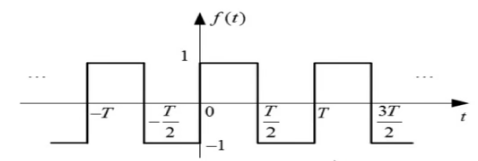
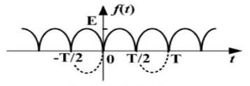

# 5.1 信号的正交函数分解

正弦信号叠加得到周期信号

叠加的正弦信号越多，越接近理想波形

构成周期信号的所有正弦信号的频率是叠加信号频率的整数倍

改变正弦信号的振幅可以得到不同的叠加图形

正弦信号作用到先形式不变系统时的输出仍是正弦信号，室友幅度和相位可能变化，其频率和波的形状不变

# 5.2 周期信号的傅里叶级数

## 5.2.1 傅里叶级数的三角形式

### 一、狄里赫利条件

在一个周期内，如果有间断点存在，则间断点的数目有限

在一个周期内，极大值和极小值的数目有限

在一个周期内,信号是绝对可积的

### 二、傅里叶级数

$\large f(t)=a_0+\sum_{n=1}^\infty[a_ncos(n\omega_1t)+b_nsin(n\omega_1t)]$

$\large a_0={1 \over T_1}\int_{T_1}f(t)dt$

$\large a_n={2 \over T_1}\int_{T_1}f(t)cos(n\omega_1t)dt$

$\large b_n={2 \over T_1}\int_{T_1}f(t)sin(n\omega_1t)dt$

### 三、周期特性

原函数为奇函数，$\large a_n=0$

原函数为偶函数，$\large b_n=0$

### 四、谐波特性

#### 1.奇谐函数

$\large f(t)=-f(t \pm {T \over 2})$

傅里叶级数中只含有奇次谐波

$\large a_0=a_2=...=b_2=b_4=...=0$

#### 2.偶谐函数

$\large f(t)=f(t \pm {T \over 2})$

傅里叶级数中只含有偶次谐波

$\large a_1=a_3=...=b_1=b_3=...=0$

## 5.2.2 傅里叶级数的指数形式

由欧拉公式得：

$\Large cos(n\omega_1t)={1\over 2}(e^{jn\omega_1t}+e^{-jn\omega_1t})$

$\Large sin(n\omega_1t)={1\over 2j}(e^{jn\omega_1t}-e^{-jn\omega_1t})$

$\displaystyle\Large f(t)=a_0+\sum_{n=1}^\infty[{a_n\over 2}(e^{jn\omega_1t}+e^{-jn\omega_1t})+{b_n\over 2j}(e^{jn\omega_1t}-e^{-jn\omega_1t})]\\\Large=a_0+\sum_{n=1}^\infty({a_n-jb_n\over 2}e^{jn\omega_1t})+\sum_{n=1}^\infty({a_n+jb_n\over 2}e^{-jn\omega_1t})$

令：$\Large F_n={a_n-jb_n \over 2}$  $\Large F_{-n}={a_{-n}-jb_{-n} \over 2}={a_n+jb_n \over 2}$

$\displaystyle\Large f(t)=F_0+\sum_{n=-\infty}^{\infty}F_ne^{jn\omega_1}t$

$\Large F_n={1 \over T_1}\int_{T_1}f(t)e^{-jn\omega_1t}dt$

## 5.2.3 周期信号的频谱

原函数：$\large f(t)=1+3cos(2t)+4sin(2t)+cos(4t+0.25\pi)$

三角形式：$\large f(t)=1+5cos(2t-0.295\pi)+cos(4t+0.25\pi)$

单边谱：

| 频率 | 幅度 |    相位     |  备注   |
| :--: | :--: | :---------: | :-----: |
|  0   |  1   |      0      | 直流量  |
|  2   |  5   | $-0.295\pi$ |  基波   |
|  4   |  1   |  $0.25\pi$  | 2次谐波 |

指数形式：$\large f(t)=1+{5\over 2}e^{j2t}e^{-j0.295\pi}+{5\over 2}e^{-j2t}e^{j0.295\pi}+{1\over 2}e^{j4t}e^{j0.25\pi}+{1\over 2}e^{-j4t}e^{-j0.25\pi}$

双边谱：

| 频率 | 幅度 |    相位     |
| :--: | :--: | :---------: |
|  -4  | 1/2  | $-0.25\pi$  |
|  -2  | 5/2  | $0.295\pi$  |
|  0   |  1   |      0      |
|  2   | 5/2  | $-0.295\pi$ |
|  4   | 1/2  |  $0.25\pi$  |

## 5.2.4 帕斯瓦尔定理

信号的总能量既可以按照每单位时间内的能量在整个时间内的积分计算出来，也可以按照每单位频率内的能量在整个频率范围内的积分而得到

$\large f(t)=c_0+\sum_{n=1}^{\infty}c_ncos(n\omega_1t+\varphi_n)$

$\large P={1 \over T_1}\int_{T_1}|f(t)|^2dt={1 \over T_1}\int_{T_1}[c_0+\sum_{n=1}^{\infty}c_ncos(n\omega_1t+\varphi_n)]^2dt\\\large=c_0^2+{1 \over 2}\sum_{n=1}^{\infty}c_n^2=\sum_{n=1}^{\infty}|F_n|^2$

# 5.3 傅里叶变换

## 5.3.1 典型非周期信号的傅里叶变换

## 5.3.2 傅里叶变换的性质

## 5.3.3 周期信号的傅里叶变换

# 5.4 抽样和抽样定理

## 5.4.1 抽样和抽样信号频谱

## 5.4.2 时域抽样定理

# 5.5 连续时间系统的频域分析

# 5.6 傅里叶变换的应用

## 5.6.1 系统无失真传输

## 5.6.2 理想滤波器

## 5.6.3 调制解调