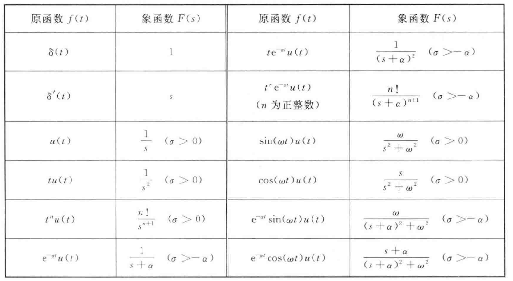

# 6.1 拉普拉斯变换

## 6.1.1 从傅里叶变换到拉普拉斯变换

### 一、拉普拉斯变换

当函数不满足**绝对可积**时，引入**衰减因子**$\large e^{-\sigma t}$，使得信号满足绝对可积，从而可以进行傅里叶变换

$\large F(\sigma +j\omega)=\mathcal F[f(t)e^{-\sigma t}]=\int_{-\infty}^{\infty}f(t)e^{-{(\sigma+j\omega)t}}dt$

$\large f(t)={1 \over 2\pi}\int_{-\infty}^{\infty}F(\sigma +j\omega)e^{{(\sigma+j\omega)t}}d\omega$

令$\large s=\sigma+j\omega$

$\large F(s)=\int_{-\infty}^{\infty}f(t)e^{-st}dt$

$\large f(t)={1 \over 2\pi j}\int_{\sigma-j\infty}^{\sigma+j\infty}F(s)e^{st}ds$

记作$\large f(t) \leftrightarrow F(s)+收敛域$

### 二、收敛域

#### 1.双边拉普拉斯变换

因果信号：$\large Re[s]=\sigma>\alpha$

反因果信号：$\large Re[s]=\sigma<\beta$

双边信号：$\large \alpha <\sigma<\beta$

#### 2.单边拉普拉斯变换

实际连续信号都是因果信号，分析实际系统从$\large 0_-$时刻开始

因此使用单边拉普拉斯变换$\large F(s)=\int_{0_-}^{\infty}f(t)e^{-st}dt$

只要$\large \sigma$大于某一个值$\large \sigma_0$，使得$\large \lim\limits_{t \to \infty}f(t)e^{-\sigma t}=0$成立，信号的单边拉普拉斯变换存在

## 6.1.2 常用信号的拉普拉斯变换

## 6.1.3 拉普拉斯变换的性质

线性：$\large af_1(t)+bf_2(t) \leftrightarrow aF_1(s)+bF_2(s)$

尺度：$\large f(at) \leftrightarrow {1 \over a}F({s \over a})$

延时：$\large f(t-t_0) \leftrightarrow e^{-st_0}F(s)\quad t>0$

频移：$\large f(t)e^{-at} \leftrightarrow F(s+a)$

微分：$\large f'(t) \leftrightarrow sF(s)-f'(0_-)$

​			$\large f''(t) \leftrightarrow s^2F(s)-sf(0_-)-f'(0_-)$

​			若f为因果信号，$\large f^{(n)}(t) \leftrightarrow s^nF(s)$

​			$\large -tf(t) \leftrightarrow {dF(s) \over ds}$

积分：$\large \int_{-\infty}^tf(x)dx = f^{(-1)}(t) \leftrightarrow s^{-1}F(s)+s^{-1}f^{(-1)}(0_-)$

​			$\large (\int_0^t)^nf(x)dx \leftrightarrow {1 \over s^n}F(s)$

​			$\large {f(t)\over t} \leftrightarrow \int_s^{\infty}F(x)dx$

卷积：$\large f_1(t)*f_2(t) \leftrightarrow F_1(s)\cdot F_2(s)$

初值定理：$\large f(0_+)=\lim\limits_{s \to \infty}sF(s)$

终值定理：$\large f(\infty)=\lim\limits_{s \to 0}sF(s)$

# 6.2 拉普拉斯反变换

# 6.3 拉普拉斯变换求解微分方程

# 6.4 拉普拉斯变换分析电路

## 6.4.1 电路元件的s域模型

## 6.4.2 用s域模型分析电路

# 6.5 系统函数及零极点分析

## 6.5.1 系统函数

## 6.5.2 系统函数的零极点

## 6.5.3 系统的稳定性分析