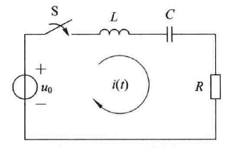

# 6.1 拉普拉斯变换

## 6.1.1 从傅里叶变换到拉普拉斯变换

### 一、拉普拉斯变换

当函数不满足**绝对可积**时，引入**衰减因子**$\large e^{-\sigma t}$，使得信号满足绝对可积，从而可以进行傅里叶变换

$\large F(\sigma +j\omega)=\mathscr F[f(t)e^{-\sigma t}]=\int_{-\infty}^{\infty}f(t)e^{-{(\sigma+j\omega)t}}dt$

$\large f(t)={1 \over 2\pi}\int_{-\infty}^{\infty}F(\sigma +j\omega)e^{{(\sigma+j\omega)t}}d\omega$

令$\large s=\sigma+j\omega$

$\large F(s)=\int_{-\infty}^{\infty}f(t)e^{-st}dt$

$\large f(t)={1 \over 2\pi j}\int_{\sigma-j\infty}^{\sigma+j\infty}F(s)e^{st}ds$

记作$\large f(t) \leftrightarrow F(s)+收敛域$

### 二、收敛域

#### 1.双边拉普拉斯变换

因果信号：$\large Re[s]=\sigma>\alpha$

反因果信号：$\large Re[s]=\sigma<\beta$

双边信号：$\large \alpha <\sigma<\beta$

#### 2.单边拉普拉斯变换

实际连续信号都是因果信号，分析实际系统从$\large 0_-$时刻开始

因此使用单边拉普拉斯变换$\large F(s)=\int_{0_-}^{\infty}f(t)e^{-st}dt$

只要$\large \sigma$大于某一个值$\large \sigma_0$，使得$\large \lim\limits_{t \to \infty}f(t)e^{-\sigma t}=0$成立，信号的单边拉普拉斯变换存在

## 6.1.2 常用信号的拉普拉斯变换

## 6.1.3 拉普拉斯变换的性质

线性：$\large af_1(t)+bf_2(t) \leftrightarrow aF_1(s)+bF_2(s)$

尺度：$\large f(at) \leftrightarrow {1 \over a}F({s \over a})$

延时：$\large f(t-t_0) \leftrightarrow e^{-st_0}F(s)\quad t>0$

频移：$\large f(t)e^{-at} \leftrightarrow F(s+a)$

微分：$\large f'(t) \leftrightarrow sF(s)-f'(0_-)$

​			$\large f''(t) \leftrightarrow s^2F(s)-sf(0_-)-f'(0_-)$

​			若f为因果信号，$\large f^{(n)}(t) \leftrightarrow s^nF(s)$

​			$\large -tf(t) \leftrightarrow {dF(s) \over ds}$

积分：$\large \int_{-\infty}^tf(x)dx = f^{(-1)}(t) \leftrightarrow s^{-1}F(s)+s^{-1}f^{(-1)}(0_-)$

​			$\large (\int_0^t)^nf(x)dx \leftrightarrow {1 \over s^n}F(s)$

​			$\large {f(t)\over t} \leftrightarrow \int_s^{\infty}F(x)dx$

卷积：$\large f_1(t)*f_2(t) \leftrightarrow F_1(s)\cdot F_2(s)$

初值定理：$\large f(0_+)=\lim\limits_{s \to \infty}sF(s)$

终值定理：$\large f(\infty)=\lim\limits_{s \to 0}sF(s)$

# 6.2 拉普拉斯反变换

$F(s)$化为有理真分式，分子为零的点为**零点**，分母为零的点为**极点**

## 6.2.1 单阶实数极点

已知：$\large F(s)={3s+1 \over s^2+5s+6}$

求解：因果信号$\large f(t)$

$\large F(s)={3s+1 \over (s+2)(s+3)}={K_1\over s+2}+{K_2\over s+3}$

$\large K_1=(s+2)F(s)|_{s=-2}=-5$

$\large K_2=(s+3)F(s)|_{s=-3}=8$

$\large F(s)={-5\over s+2}+{8\over s+3}$

$\large f(t)=(-5e^{-2t}+8e^{-3t})u(t)$

## 6.2.2 共轭复数极点

已知：$\large F(s)={s+1 \over (s+1)^2+4}$

求解：因果信号$\large f(t)$

$\large F(s)={K_1 \over s+1-2j}+{K_2 \over s+1+2j}$

$\large K_1=(3+1-2j)F(s)|_{s=-1+2j}={1\over 2}$

$\large K_1=(3+1+2j)F(s)|_{s=-1-2j}={1\over 2}$

$\large F(s)={{1\over 2} \over s+1-2j}+{{1\over 2} \over s+1+2j}$

$\large f(t)=({1\over 2}e^{(-1+2j)t}+{1\over 2}e^{(-1-2j)t})u(t)=e_{-t}cos(2t)u(t)$

## 6.2.3 实数重根极点

已知：$\large F(s)={s^2 \over (s+1)^3}$

求解：因果信号$\large f(t)$

$\large F(s)={K_1 \over (S+1)^3}+{K_2 \over (S+1)^2}+{K_3 \over S+1}$

两边同乘$\large (s+1)^3$，得$\large s^2=K_1+(s+1)K_2+(s+1)^2K_3$

代入$\large s=-1$，得$\large K_1=1$

两边对s求导，得$\large 2s=K_2+2(s+1)K_3$

代入$\large s=-1$，得$\large K_2=-2$

两边对s求导，得$\large K_3=1$

即$\large F(s)={1 \over (S+1)^3}-{2 \over (S+1)^2}+{1 \over S+1}$

$\large f(t)=({1\over 2}t^2e^{-t}-2te^{-t}+e^{-t})u(t)$

# 6.3 拉普拉斯变换求解微分方程

已知：$\large y''(t)+5y'(t)+6y(t)=2x'(t)+6x(t)$

​			$\large y(0_-)=1,y'(0_-)=-1$

​			$\large x(t)=e^{-t}u(t)$

求解：零状态响应、零输入响应、完全响应

$\large X(s)={1 \over s+1} \quad X'(t)=sX(s)-x(0_-)={s \over s+1}$

$\large y'(t)=sY(s)-y(o_-)=sY(s)-1 \quad y''(t)=s^2Y(s)-sy(0_-)-y'(0_-)=s^2Y(s)-s+1$

原式化为$\large (s^2+5s+6)Y(s)=2(s+3)X(s)+s+4$

$\large Y(s)={2(s+3) \over s^2+5s+6}X(s)+{s+4 \over s^2+5s+6}$

$\large Y_{zs}(s)={2(s+3) \over s^2+5s+6}X(s)={-2 \over s+2}+{2 \over s+1} \leftrightarrow y_{zs}(t)=(-2e^{-2t}+2e^{-t})u(t)$

$\large Y_{zi}(s)={s+4 \over s^2+5s+6}={2 \over s+2}+{-1 \over s+3} \leftrightarrow y_{zi}(t)=(2e^{-2t}-e^{-3t})u(t)$

$\large y(t)=y_{zs}(t)+y_{zi}(t)=(2e^{-t}-e^{-3t})u(t)$

# 6.4 拉普拉斯变换分析电路

## 6.4.1 电路元件的s域模型

### 一、电阻模型

$\large u(t)=Ri(t) \leftrightarrow U(s)=RI(s)$

### 二、电容模型

$\large i(t)=C{du_C(t)\over dt} \leftrightarrow I(s)=sCU_C(s)-Cu_C(0_-) \leftrightarrow U_C(s)={1 \over sC}I(s)+{1 \over s}u_C(0_-)$

### 三、电感模型

$\large u(t)=L{di_L(t) \over dt} \leftrightarrow U(s)=sLI_L(s)-Li_L(0_-) \leftrightarrow I_L(s)={1 \over sL}U(s)+{i_L(0_-) \over s}$

## 6.4.2 用s域模型分析电路

已知：$\large u_0=1,L=1,C=0.5,R=3$

求解：$\large i(t)$

$\Large {u_0 \over s}=sLI(s)+{1 \over sC}I(s)+RI(s)$

$\Large I(s)={u_0 \over s(sL+{1 \over sC}+R)}={1 \over s^2+3s+2}={1 \over s+1}+{-1 \over s+2}$

$\Large i(t)=(e^{-t}-e^{-2t})u(t)$

# 6.5 系统函数及零极点分析

## 6.5.1 系统函数

$\large H(s)={Y_{zs}(s) \over F(s)}$

$\large H(s)$是单位冲激响应$\large h(t)$的拉普拉斯变换

已知：$\large y''(t)+5y'(t)+6y=2x''(t)+6x'(t)$

​			$\large x(t)=(1+e^{-t})u(t)$

求解：系统函数，单位冲激响应，零状态响应

$\large s^2Y_{zs}(s)+5sY_{zs}(s)+6Y_{zs}(s)=2s^2X(s)+6sX(s)$

$\large H(s)={Y_{zs}(s) \over X(s)}={2s^2+6s \over s^2+5s+6}=2-{4 \over s+2} \leftrightarrow h(t)=2\delta(t)-4e^{-2t}u(t)$

$\large Y_{zs}(s)={2s^2+6s \over s^2+5s+6}X(s)={2s^2+6s \over s^2+5s+6}\cdot ({1 \over s}+{1 \over s+1})={-2 \over s+1}+{6 \over s+2} \leftrightarrow y_{zs}(t)=(6e^{-2t}-2e^{-t})u(t)$

## 6.5.2 系统函数的零极点

### 一、定义

$H(s)$化为有理真分式，分子为零的点为**零点**，分母为零的点为**极点**

在图中，零点用$\bigcirc$表示，极点用$\times$表示

### 二、极点分布与时域响应的关系

#### 1.左半开平面

负实数单极点$\large p=-\alpha$，分母有$\large s+\alpha$，响应为$\large Ke^{-\alpha t}u(t)$，逐渐衰减

共轭复数极点$\large p_{1,2}=-\alpha \pm j\beta$，分母有$\large (s+\alpha)^2+\beta^2$，响应为$\large Ke^{-\alpha t}cos(\beta t+\theta)u(t)$，振荡衰减

二重实数极点$\large p_{1,2}=-\alpha$，分母有$\large (s+\alpha)^2$，响应为$\large Kte^{-\alpha t}u(t)$，逐渐衰减

以上三种在正无穷处响应均趋于0

#### 2.虚轴上

实数单极点$\large p=0$，分母中有$\large s$，响应为$\large Ku(t)$，保持恒定

共轭极点$\large p_{1,2}=\pm j\beta$，分母中有$\large s^2+\beta^2$，响应为$\large Kcos(\beta t+\theta)u(t)$，振荡

二重实数极点$\large p_{1,2}=0$，分母有$\large s^2$，响应为$\large Ktu(t)$，逐渐增强

#### 3.右半开平面

负实数单极点$\large p=\alpha$，分母有$\large s-\alpha$，响应为$\large Ke^{\alpha t}u(t)$，逐渐增强

共轭复数极点$\large p_{1,2}=\alpha \pm j\beta$，分母有$\large (s-\alpha)^2+\beta^2$，响应为$\large Ke^{\alpha t}cos(\beta t+\theta)u(t)$，振荡增强

二重实数极点$\large p_{1,2}=\alpha$，分母有$\large (s-\alpha)^2$，响应为$\large Kte^{\alpha t}u(t)$，逐渐增强

以上三种在正无穷处响应均趋于正无穷

## 6.5.3 系统的稳定性分析

### 一、定义

充要条件：单位冲激响应绝对可积 $\large \int_{-\infty}^{\infty}|h(t)|dt<\infty$

对于因果信号：$\large \int_0^{\infty}|h(t)|dt<\infty$

### 二、判别

#### 1.极点都在左半开平面

系统稳定

#### 2.极点在虚轴上有一阶极点，剩余极点在左半开平面

虽然不满足绝对可积，但系统临界稳定

#### 3.极点位于右半开平面或存在高阶极点

不满足绝对可积，系统不稳定
