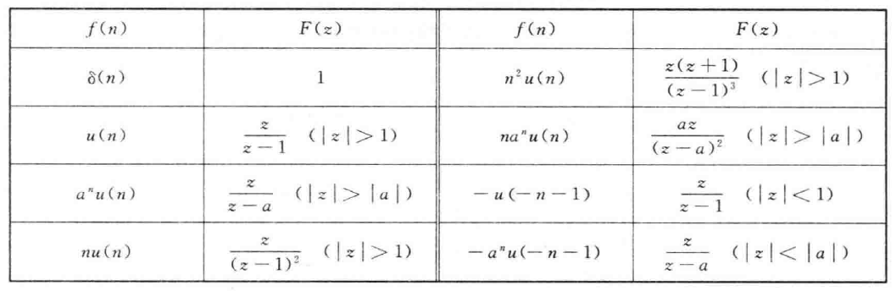

# 7.1 z变换

## 7.1.1 z变换的定义

### 一、由拉普拉斯变换到z变换

对于连续信号进行理想采样得到采样信号

$\displaystyle\large f_s(t)=f(t)\delta_T(t)=\sum_{n=-\infty}^{\infty}f(nT)\delta(t-kT)$

进行拉普拉斯变换

$\displaystyle\large F(s)=\sum_{n=-\infty}^{\infty}f(nT)e^{-nsT}$

令$\large z=e^{sT}$

$\displaystyle\large F(z)=\sum_{n=-\infty}^{\infty}f(nT)z^{-n}=\sum_{n=-\infty}^{\infty}f(n)z^{-n}$

### 二、z变换的定义

双边z变换：$\displaystyle\large F(z)=\sum_{n=-\infty}^{\infty}f(n)z^{-n}$

单边z变换：$\displaystyle\large F(z)=\sum_{n=0}^{\infty}f(n)z^{-n}$

记作：$\large \mathscr Z[f(n)]=F(z)\quad f(n) \leftrightarrow F(z)$

### 三、收敛域

绝对可和：$\displaystyle\large\sum_{n=-\infty}^{\infty}|f(n)z^{-n}| < \infty$

满足绝对可和的所有z值组成的集合称为收敛域

因果信号的收敛域在某一个圆外

反因果信号的收敛域在某一个圆内

双边信号的收敛域在某一个圆环内

## 7.1.2 典型序列的z变换

## 7.1.3 z变换的性质

线性：$\large a_1f_1(k)+a_2f_2(k) \leftrightarrow a_1F_1(z)+a_2F_2(z)$

双边移序：$\large f(k \pm m) \leftrightarrow z^{\pm m}F(z)$

单边移序：$\displaystyle\large f(n-m) \leftrightarrow z^{-m}F(z)+z^{-m}\sum_{k=-m}^{-1}f(k)z^{-k}$

​					$\displaystyle\large f(n+m) \leftrightarrow z^mF(z)+z^m\sum_{k=0}^{m-1}f(k)z^{-k}$

反褶：$\large f(-k) \leftrightarrow F(z^{-1})$

尺度变换：$\large a^nf(n) \leftrightarrow F({z \over a})$

微分性质：$\large nf(n) \leftrightarrow -z{dF(z)\over dz}$

卷积和：$\large f_1(n)*f_2(n) \leftrightarrow F_1(z)\cdot F_2(z)$

初值定理：$\large f(0)=\lim\limits_{z \to \infty}F(z)$

终值定理：$\large f(\infty)=\lim\limits_{z \to 1}(z-1)F(z)$

# 7.2 z变换与拉普拉斯变换的关系

对$\large f(t)$进行理想采样后进行双边拉普拉斯变换：

$\displaystyle\large F(s)=\sum_{n=-\infty}^{\infty}f(nT)e^{-nsT}$

对$\large f(t)$进行理想采样后进行双边z变换：

$\displaystyle\large F(z)=\sum_{n=-\infty}^{\infty}f(nT)z^{-n}$

二者存在映射关系：$\large z=e^{sT}$

将s平面表示为$\large s= \sigma +j\omega$

将z平面表示为$\large z=re^{j\theta}$

则$\large z=e^{(\sigma +j\omega)T}=e^{\sigma T}\cdot e^{j\omega T}$

存在以下关系：

$\large r=e^{\sigma T}\quad \theta=\omega T$

### 一、$\large \sigma$与$\large r$的关系

s平面虚轴($\large \sigma =0$)映射到z平面的单位圆

s平面左半平面($\large \sigma < 0$)映射到z平面的单位圆内

s平面右半平面($\large \sigma > 0$)映射到z平面的单位圆外

### 二、$\large \omega$与$\large \theta$的关系

s平面实轴($\large \omega =0$)映射到z平面的正实轴

s平面$\large \omega$从$\large {-\pi \over T}$到0映射到z平面从$\large -\pi$到0

s平面$\large \omega$从0到$\large {\pi \over T}$映射到z平面从0到$\large \pi$

# 7.3 z反变换

## 7.3.1 幂级数展开法

### 一、因果信号

已知：$\large F(z)={z \over z-a},|z|>|a|$

求解：$\large f(t)$

由于收敛域在圈外，故原信号为因果序列

$\displaystyle\large F(z)=\sum_{n=0}^{\infty}f(n)z^{-n}$

使用长除法将$\large F(z)$展开

$\displaystyle\large F(z)=f(0)z^0+f(1)z^{-1}+f(2)z^{-2}+...=1+az^{-1}+a^2z^{-2}+...=\sum_{n=0}^{\infty}a^nz^{-n}$

即$\large f(n)=a^nu(n)$

### 二、反因果信号

已知：$\large F(z)={z \over z-a},|z|>|a|$

求解：$\large f(t)$

由于收敛域在圈内，故原信号为反因果序列

$\displaystyle\large F(z)=\sum_{n=-\infty}^{0}f(n)z^{-n}$

使用长除法将$\large F(z)$展开

$\displaystyle\large F(z)=f(0)z^0+f(1)z^{1}+f(2)z^{2}+...=-a^{-1}z-a^{-2}z^2-a^{-3}z^3+...$

即$\large f(n)=-a^nu(-n-1)$

## 7.3.2 部分分式展开法

### 一、单阶实数根

已知：$\large F(z)={z^2 \over (z+1)(z-2)},1<|z|<2$

求解：$\large f(n)$

$\Large {F(z) \over z}={z \over (z+1)(z-2)}={K_1 \over z+1}+{K_2 \over z-2}$

$\Large K_1=(z+1){F(z) \over z}|_{z=-1}={1 \over 3}$

$\Large K_2=(z-2){F(z) \over z}|_{z=2}={2 \over 3}$

$\Large F(z)={1 \over 3}{z \over z+1}+{2 \over 3}{z \over z-2}$

收敛域为$\large 1<|z|<2$，则$\large {z \over z+1}$为因果序列，$\large {z \over z-2}$为反因果序列

$\Large f(n)={1 \over 3}\cdot (-1)^nu(n)-{2 \over 3}\cdot 2^nu(-n-1)$

### 二、实数重根

已知：$\large F(z)={z^2 \over (z-2)^2},|z|>2$

求解：$\large f(n)$

$\Large {F(z) \over z}={z \over (z-2)^2}={K_1 \over (z-2)^2}+{K_2 \over z-2}$

$\Large K_1=(z-2)^2{F(z) \over z}|_{z=2}=2$

$\Large K_2={d[(z-2)^2{F(z) \over z}] \over dz}|_{z=2}=1$

$\Large K_i={1 \over i-1}[{d^{i-1} \over dz^{i-1}}[(z-p_i)^m{F(z) \over z}]]|_{z=p_1}$

$\Large F(z)={2z \over (z-2)^2}+{z \over z-2}$

$\Large f(n)=[n2^n+2^n]u(n)$

### 三、共轭复数根

已知：$\large F(z)={z \over (z+1)^2+1},|z|>\sqrt2$

求解：$\large f(n)$

$\Large {F(z) \over z}={1 \over (z+1)^2+1}={K_1 \over z+1-j}+{K_2 \over z+1+j}$

$\large K_1=(z+1-j)F(z)|_{z=-1+j}={1 \over 2j}$

$\large K_2=(z+1+j)F(z)|_{z=-1-j}={1 \over -2j}$

$\Large F(z)={1 \over 2j}\cdot {z \over z+1-j}-{1 \over 2j}\cdot {z \over z+1+j}$

$\large f(n)=[{1 \over 2j}(-1+j)^n-{1 \over 2j}(-1-j)^n]u(n)$

# 7.4 z变换求解差分方程

已知：$\large y(n)-y(n-1)-2y(n-2)=x(n)+2x(n-2)$

​			$\large y(-1)=2,y(-2)=-{1 \over 2},x(n)=u(n)$

求解：零状态响应，零输入响应，完全响应

$\large x(n)=u(n) \leftrightarrow X(z)={z \over z-1}$

$\large x(n-2) \leftrightarrow z^{-2}X(z)$

$\large y(n-1) \leftrightarrow z^{-1}Y(z)+y(-1)=z^{-1}Y(z)+2$

$\large y(n-2) \leftrightarrow z^{-2}Y(z)+z^{-1}y(-1)+y(-2)=z^{-2}Y(z)+2z^{-1}-{1 \over 2}$

$\Large Y(z)={1+2z^{-2} \over 1-z^{-1}-2z^{-2}}X(z)+{4z^{-1}+1 \over 1-z^{-1}-2z^{-2}}$

$\Large Y_{zs}(z)={1+2z^{-2} \over 1-z^{-1}-2z^{-2}}X(z)={z^2+2 \over z^2-z-2}\cdot {z \over z-1}$

$\Large {Y_{zs}(s) \over z}={K_1 \over z-1}+{K_2 \over z-2}+{K_3 \over z+1}$

解得$\Large Y_{zs}(z)=-{3 \over 2}{z \over z-1}+2{z \over z-2}+{1 \over 2}{z \over z+1}$

$\large y_{zs}(n)=[2^{n+1}+{1 \over 2}(-1)^n-{3 \over 2}]u(n)$

$\Large Y_{zi}(z)={4z^{-1}+1 \over 1-z^{-1}-2z^{-2}}$

$\Large {Y_{zi}(s) \over z}={2 \over z-2}+{-1 \over z+1}$

$\Large {Y_{zi}(s)}={2z \over z-2}+{-z \over z+1}$

$\Large y_{zi}(n)=[2^{n+1}-(-1)^n]u(n)$

$\Large y(n)=y_{zs}(n)+y_{zi}(n)=[2^{n+2}-{1 \over 2}(-1)^n-{3 \over 2}]u(n)$

# 7.5系统函数及零极点分析

## 7.5.1 系统函数

$\large H(z)={Y_{zs}(z) \over X(z)}$

$\large H(z)$是单位样值响应$\large \delta(n)$的z变换

已知：$\large y(n)+y(n-1)-2y(n-2)=x(n)+x(n-1)$

求解：系统函数、单位样值响应

$\large (1+z^{-1}-2z^{-2})Y_{zs}(z)=(1+z^{-1})X(z)$

$\Large H(z)={Y_{zs}(z) \over X(z)}={z^2+z \over z^2+z-2}$

$\Large {H(z) \over z}={z+1 \over (z+2)(z-1)}={{1 \over 3} \over z+2}+{{2 \over 3} \over z-1}$

$\Large H(z)={1 \over 3}\cdot{z \over z+2}+{2 \over 3}\cdot{z \over z-1}$

$\large h(n)=[{1 \over 3} \times (-2)^n+{2 \over 3}]u(n)$

## 7.5.2 零极点分析

$H(z)$化为有理真分式，分子为零的点为**零点**，分母为零的点为**极点**

在图中，零点用$\bigcirc$表示，极点用$\times$表示

对于因果信号，极点均位于单位圆内时，系统稳定
